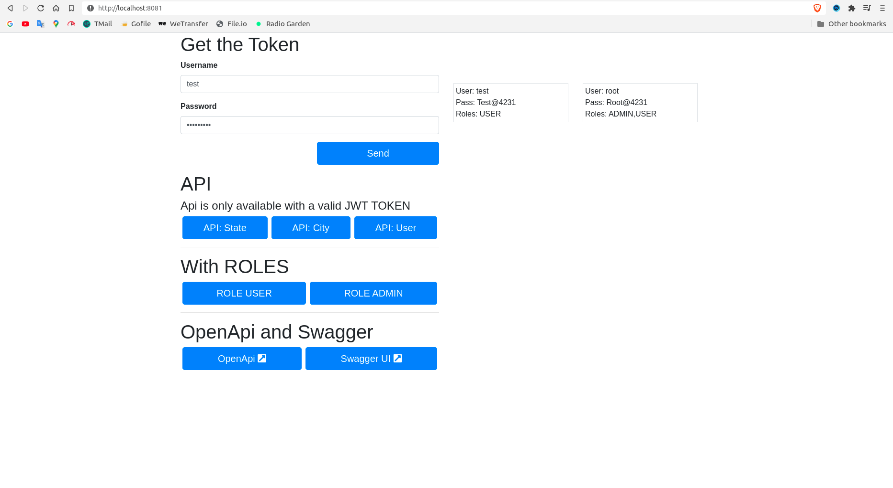

# spring-boot-crud
Api Rest Crud with Java + Spring Boot + Swagger UI

# Requirements
1. [Sdkman](https://sdkman.io/install)
2. [Java (JRE/JDK)](https://openjdk.java.net/install/index.html)
3. [Gradle](https://gradle.org/install/)

# Setup
### **With sdkman installed:**
```shell
sdk install java 15.0.1-open
sdk install gradle 6.7.1

sdk default java 15.0.1-open
sdk default gradle 6.7.1
```
```shell
git clone https://github.com/stdioh321/spring-boot-crud.git
cd spring-boot-crud
```
# Run
```shell
gradle bootRun
```

Your terminal should looks like this:


Open your browser at the url:<br>
### **http://localhost:8080**

|Index|Index with JWT|
|---|---|
|||


# References
* [Spring Boot](https://spring.io/projects/spring-boot)
* [Swagger UI](https://swagger.io/tools/swagger-ui/)
